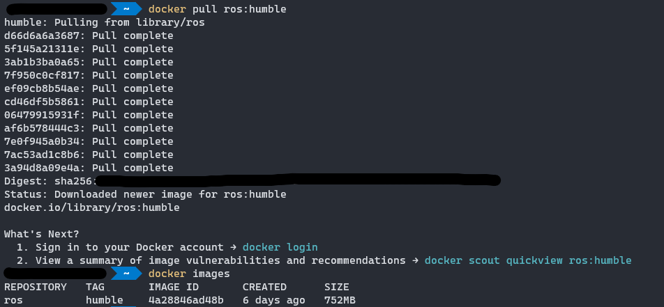
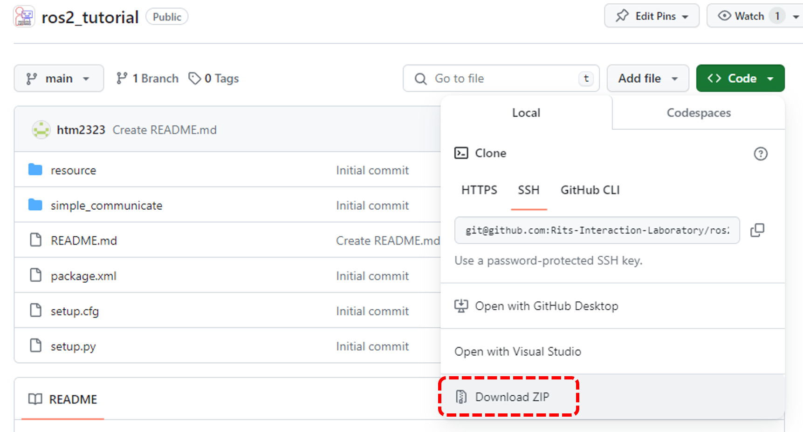
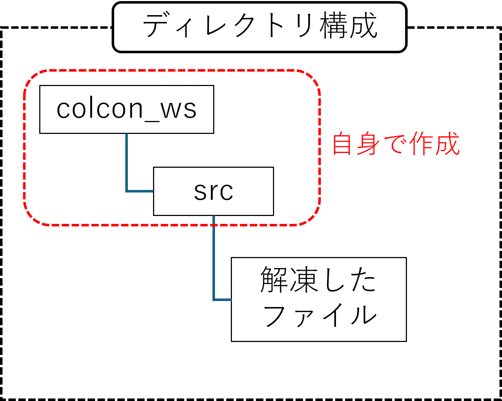
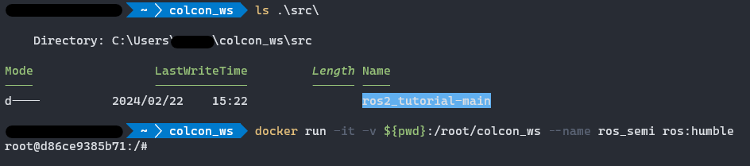

ROS講習会に用いる，簡単な配信・購読機能を持たせたROS2パッケージです．

# ROS講習会環境構築手順
本講習では，dockerを用いてubuntu22.04, ROS2 humbleの環境を用います．
ご自身の環境にすでにdockerを使用できる場合は1の手順をスキップして下さい． 
また今回の講習における環境構築手順では，ホストOS側にワークスペースディレクトリを用意し，それをdockerコンテナと共有します．

## 1. docker desktopのインストール
[こちら](https://www.docker.com/products/docker-desktop/)から自身のOSに合うdocker desktopのインストーラのダウンロードをお願いします．
<!--
この手順の詳細は，[こちら]()にあります．不明点等あれば，参照して下さい．
docker desktopのインストールが完了すると，以下のような画面となります．
この状態で，コマンドプロンプト(windowsの場合)等から `docker` と入力した際に以下のようなサブコマンドが提案される出力を確認できたら，正常にインストールが完了しています．
-->

## 2. docker imageの取得
本講習で使用するROS環境を用意するため，ROS2 humbleのdocker imageをdocker hubから取得します．下記のコマンドを実行して下さい． 
`docker pull ros:humble`  
コマンド実行後, `docker images`(現在持っているdocker imageの一覧を表示するコマンド)を実行し，`ros`という名前のimageが存在することを確認して下さい．
ここまでを実行すると以下のような出力になるはずです． 

## 3. ROS講習会用プログラムの取得
このリポジトリから今回の講習会で使用するプログラムをダウンロードします． 
git環境がない場合，zipで落としてもらって構いません．ダウンロード方法は以下の画像のように，ページ右上の「Code」ボタンから「Download ZIP」を選択します． 

ダウンロードが完了したら,zipファイルを解凍してください．
そして，任意の場所に`colcon_ws`というディレクトリを作成し，解凍したファイルを移動させて以下のような構成にしてください． 

なお，git環境がある方は，`colcon_ws/src`のディレクトリを作成し，その中で以下のコマンドを実行すれば導入可能です． 
`git clone https://github.com/Rits-Interaction-Laboratory/ros2_tutorial.git`

## 4. dockerの起動
3番の手順で準備した`colcon_ws`のディレクトリで，コマンドプロンプト等を起動して下さい． 
コマンドプロンプトが起動したら，以下のコマンドを実行して下さい． 
`docker run -it -v ${pwd}:/root/colcon_ws --name ros_semi ros:humble` 
（docker run のvオプション， `-v マウント元:マウント先`　でhostとdockerで共有するディレクトリを指定しています．この状態としておくことで，ホストOS側のvscode等，エディタで加えた編集がdockerコンテナ側にも反映されます．）

以下のような出力になれば環境構築完了です． 

